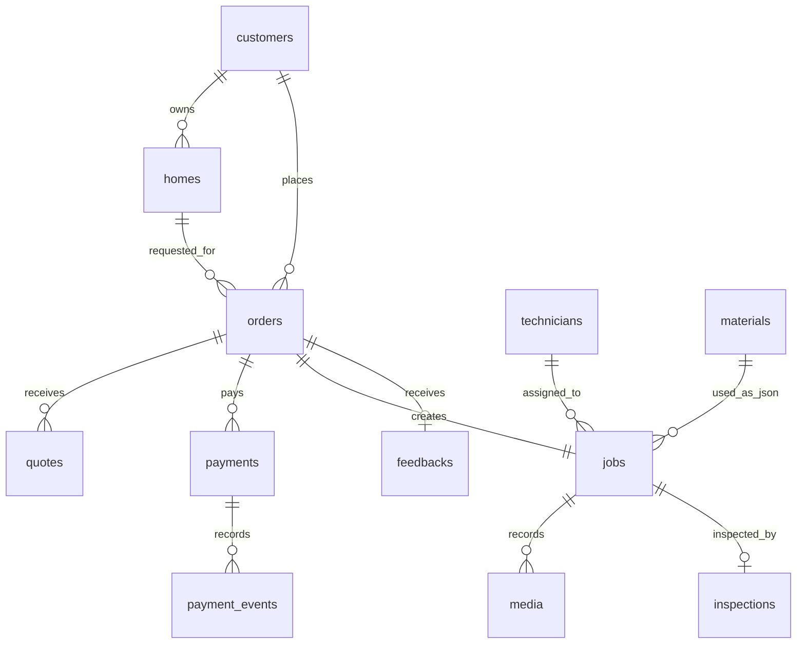

# Buildus Care Backend Spec v1

문서 목적: 빌드어스 케어 Phase 1 백엔드 개발 기준 문서입니다. 고객이 시공을 선택하고 주소/사진을 제출한 뒤 견적, 결제, 예약, 기사 작업, 검수, 후기까지 이어지는 **집수리/시공 운영 OS**의 데이터 구조와 API 계약을 정의합니다.

기준 자료:

- `빌드어스_데이터수집매뉴얼_v1_2026-05-07.xlsx`
- 현재 Next.js/Supabase MVP 코드
- Phase 1 목표: `P0 테이블 12개 + Supabase 셋업 + Auth + RLS 정책`

## 1. Phase 1 범위

Phase 1은 화면 기능을 많이 붙이는 단계가 아니라, 운영 데이터가 일관되게 쌓이는 기반을 만드는 단계입니다.

### 목표

- 고객, 집, 주문, 견적, 결제, 작업, 사진, 검수, 후기, 기사, 자재 데이터를 하나의 흐름으로 연결한다.
- 주문과 작업을 분리해 상업 기록과 현장 운영 기록을 따로 관리한다.
- 사진과 후기 데이터를 향후 AI 견적, AI 검수, 시공자 매칭, 단지별 마케팅의 학습 자산으로 남긴다.
- 모든 민감 데이터는 서버 API를 통해서만 접근하고, Supabase 직접 접근은 RLS로 차단한다.

### Stage 0에서 반드시 필요한 P0 테이블

| 테이블 | 역할 | 현재 상태 |
| --- | --- | --- |
| `customers` | 고객 식별, 전화번호, 이름, 유입 정보 | 일부 구현 |
| `homes` | 고객의 집/주소/평수/건물 메타데이터 | 미구현 |
| `orders` | 시공 의뢰/상업 단위 | 일부 구현 |
| `quotes` | 견적 버전과 수락 이력 | 미구현 |
| `payments` | 결제 승인/환불/결제수단 | 일부 구현 |
| `jobs` | 실제 기사 작업/시공 운영 단위 | 일부 구현 |
| `media` | 전/중/후/자재/이슈 사진·영상 | `order_photos`로 임시 구현 |
| `inspections` | 본사 검수 체크리스트 | 미구현 |
| `feedbacks` | NPS, 5축 평가, 후기, 재의뢰 의사 | `reviews`로 임시 구현 |
| `technicians` | 직영/위탁 시공자, 스킬, 등급 | 미구현 |
| `materials` | 자재 SKU, 도매가, 판매가, 재고 | 미구현 |
| `payment_events` | Toss confirm/webhook 이벤트 멱등 로그 | 구현 |

Stage 1 직후에는 `warranty_cases`와 기본 검수 고도화가 이어집니다. Phase 1 문서에는 확장 지점을 남기되 구현 우선순위는 P0에 둡니다.

## 2. 핵심 도메인 모델

### 주문과 작업 분리

`orders`는 고객이 구매한 상업 단위입니다. 고객, 집, 견적, 결제, 주문 상태, 접근 토큰이 여기에 묶입니다.

`jobs`는 현장 운영 단위입니다. 기사 배정, 예약일, 시작/종료 시간, 실제 소요 시간, 사용 자재, 이슈, 완료 보고는 작업에 묶입니다.

현재 MVP는 주문 1건에 작업 1건을 자동 생성하지만, 장기적으로는 주문 1건이 여러 작업으로 쪼개질 수 있습니다.

### Phase 1 관계



## 3. Enum 정의

### `order_status`

엑셀 기준 상태 흐름은 `inquiry -> quoted -> paid -> scheduled -> in_progress -> done -> canceled`입니다. 현재 MVP 상태값과의 호환을 고려해 Phase 1에서는 아래처럼 정리합니다.

| 상태 | 의미 | 다음 상태 |
| --- | --- | --- |
| `inquiry` | 고객 의뢰 접수 | `quoted`, `canceled` |
| `quoted` | 견적 생성/발송 | `payment_pending`, `canceled` |
| `payment_pending` | 결제 대기 | `paid`, `canceled` |
| `paid` | 결제 완료 | `scheduled`, `canceled` |
| `scheduled` | 방문 일정 확정 | `in_progress`, `canceled` |
| `in_progress` | 시공 진행 중 | `done`, `canceled` |
| `done` | 시공 완료 | 없음 |
| `canceled` | 취소 | 없음 |

#### 기존 MVP 상태값 매핑

| 현재 MVP 상태 | Phase 1 상태 | 비고 |
| --- | --- | --- |
| `draft` | `inquiry` | 임시 주문은 문의 단계로 흡수하거나, 테스트 데이터면 삭제 |
| `submitted` | `inquiry` | 고객 의뢰 접수 |
| `reservation_pending` | `paid` 또는 `payment_pending` | 결제 완료 여부에 따라 분기 |
| `reservation_confirmed` | `scheduled` | 방문 일정 확정 |
| `payment_pending` | `payment_pending` | 유지 |
| `paid` | `paid` | 유지 |
| `preparing` | `scheduled` | 자재/기사 준비 중. 현장 시작 확인 후 `in_progress` |
| `in_service` | `in_progress` | 시공 진행 중 |
| `completed` | `done` | 시공 완료 |
| `cancelled` | `canceled` | 영문 표기 통일 |

### `job_status`

| 상태 | 의미 |
| --- | --- |
| `received` | 작업 접수 |
| `material_ready` | 자재 준비 완료 |
| `assigned` | 기사 배정 |
| `scheduled` | 일정 확정 |
| `checked_in` | 기사 현장 체크인 |
| `in_progress` | 시공 중 |
| `completed` | 시공 완료 |
| `cancelled` | 작업 취소 |

### 기타 enum

| enum | 값 |
| --- | --- |
| `reservation_time_slot` | `morning`, `afternoon`, `all_day` |
| `payment_status` | `ready`, `pending`, `done`, `failed`, `cancelled`, `refunded` |
| `media_type` | `inquiry`, `before`, `during`, `after`, `material`, `issue`, `report_video` |
| `housing_type` | `owner`, `jeonse`, `monthly_rent`, `unknown` |
| `building_type` | `apartment`, `villa`, `house`, `officetel`, `commercial`, `unknown` |
| `technician_type` | `direct`, `contractor` |
| `technician_grade` | `bronze`, `silver`, `gold`, `premium` |

`payments.status`는 빌드어스 내부 결제 라이프사이클 기준입니다. Toss의 원본 상태값(`DONE`, `CANCELED`, `ABORTED` 등)은 `payment_events.payload`에 보존하고, 필요하면 `payments.provider_status` 같은 별도 컬럼으로만 둡니다. 주문/작업 상태 전이는 내부 `payment_status`를 기준으로 처리합니다.

## 4. P0 테이블 정의

필드명은 엑셀의 P0를 우선하고, 현재 MVP와 충돌하는 필드는 마이그레이션에서 alias/임시 필드를 둡니다.

### `customers`

| 컬럼 | 타입 | 필수 | 설명 |
| --- | --- | --- | --- |
| `id` | uuid | Y | 고객 ID |
| `phone` | text | Y | 전화번호. 현재는 게스트 식별자 |
| `name` | text | Y | 이름 |
| `address_full` | text | Y | 대표 전체 주소. PII |
| `address_dong` | text | Y | 동/단지 |
| `address_apt` | text | N | 아파트/건물명 |
| `housing_type` | enum | Y | 자가/전세/월세/미확인 |
| `acquisition_source` | text | Y | 유입 채널 |
| `first_contact_at` | timestamptz | Y | 첫 접촉 시점 |
| `created_at` | timestamptz | Y | 생성 시점 |

확장 예정 P1/P2: `household_size`, `has_kids`, `has_elderly`, `utm_campaign`, `referrer_id`, `self_intent_score`.

### `homes`

| 컬럼 | 타입 | 필수 | 설명 |
| --- | --- | --- | --- |
| `id` | uuid | Y | 집 ID |
| `customer_id` | uuid | Y | `customers.id` |
| `address_full` | text | Y | 전체 주소 |
| `address_dong` | text | Y | 동/단지 |
| `address_apt` | text | N | 아파트/건물명 |
| `postal_code` | text | N | 우편번호 |
| `size_pyung` | int | Y | 평수 |
| `building_type` | enum | Y | 아파트/빌라/단독/오피스텔 등 |
| `year_built` | int | Y | 준공 연도 |
| `created_at` | timestamptz | Y | 생성 시점 |

확장 예정: `floor`, `moved_in_year`, `complex_id`, `plan_image_url`.

주소의 소스 오브 트루스는 `homes.address_full`입니다. `customers.address_full/address_dong/address_apt`는 운영 편의를 위한 최근/기본 주소 스냅샷으로만 사용하고, 고객이 여러 집을 등록하면 실제 방문 주소는 항상 `orders.home_id -> homes`를 기준으로 판단합니다.

### `orders`

| 컬럼 | 타입 | 필수 | 설명 |
| --- | --- | --- | --- |
| `id` | uuid | Y | 주문 ID |
| `order_number` | text | Y | 고객/운영 표시용 주문번호 |
| `customer_id` | uuid | Y | 고객 FK |
| `home_id` | uuid | Y | 집 FK |
| `status` | enum | Y | 주문 상태 |
| `skus` | jsonb | Y | 선택 SKU/수량/옵션 스냅샷 |
| `channel` | text | Y | 이번 주문 유입 채널 |
| `reason` | text | N | 의뢰 사유 |
| `urgency` | text | N | 긴급도 |
| `self_diagnosis` | text | N | 고객 자가진단 |
| `inquiry_photos` | jsonb | N | 의뢰 시 사진 URL 배열 |
| `access_token` | text | Y | 게스트 조회 토큰 |
| `created_at` | timestamptz | Y | 의뢰 시점 |
| `updated_at` | timestamptz | Y | 수정 시점 |

현재 MVP의 `service_type_code`, `visit_fee`, `subtotal_amount`, `total_amount`, `special_requests`는 Phase 1에서도 임시 호환 필드로 유지할 수 있습니다. 단, 금액 원천은 `quotes`로 옮깁니다.

`/api/orders` 리팩터 시 엑셀 P0 기준 필수 수집값:

- `customers.acquisition_source`: instagram, karrot, kakao, referral, phone, unknown 등
- `orders.channel`: kakao, web, phone, store 등
- `orders.reason`: broken, old, design, move_in, other 등
- `orders.urgency`: immediate, within_1w, within_2w, flexible 등
- `homes.year_built`: 준공연도. 모르면 `null`로 두되 UI/API에서 "모름"을 명시적으로 받는다.
- `orders.self_diagnosis`: P1 성격이지만 AI 의도 학습에 중요하므로 입력란은 유지한다.

`orders.skus` 예시:

```json
[
  {
    "sku": "toilet_replace",
    "qty": 1,
    "service_type": "labor_service",
    "options": [
      { "code": "angle_valve", "qty": 1 }
    ],
    "material_skus": ["TOILET-STD-A"]
  }
]
```

### `quotes`

| 컬럼 | 타입 | 필수 | 설명 |
| --- | --- | --- | --- |
| `id` | uuid | Y | 견적 ID |
| `order_id` | uuid | Y | 주문 FK |
| `version` | int | Y | 견적 버전 |
| `items` | jsonb | Y | SKU, 수량, 자재가, 시공비, 옵션 |
| `total_material` | int | Y | 총 자재가 |
| `total_labor` | int | Y | 총 시공비 |
| `visit_fee` | int | Y | 출장비 |
| `discount` | int | N | 할인 |
| `total_final` | int | Y | 최종 금액 |
| `quoted_at` | timestamptz | Y | 견적 생성/발송 시점 |
| `accepted_at` | timestamptz | N | 고객 수락 시점 |
| `created_at` | timestamptz | Y | 생성 시점 |

규칙:

- 서버가 가격을 계산한다.
- 프론트가 보낸 단가는 신뢰하지 않는다.
- 새 견적이 생성되면 `version = 이전 최대 + 1`.
- 결제는 반드시 `accepted_at`이 있는 최신 견적 기준으로 진행한다.

### `payments`

| 컬럼 | 타입 | 필수 | 설명 |
| --- | --- | --- | --- |
| `id` | uuid | Y | 결제 ID |
| `order_id` | uuid | Y | 주문 FK |
| `quote_id` | uuid | N | 기준 견적 FK |
| `provider` | text | Y | `toss` |
| `method` | text | Y | card/kakao_pay/transfer 등 |
| `payment_key` | text | N | Toss paymentKey |
| `order_name` | text | Y | Toss 표시 이름 |
| `amount` | int | Y | 결제 금액 |
| `status` | enum | Y | 결제 상태 |
| `paid_at` | timestamptz | N | 결제 완료 시점 |
| `refund_amount` | int | N | 환불 금액 |
| `requested_at` | timestamptz | N | 승인 요청 시점 |
| `approved_at` | timestamptz | N | 승인 완료 시점 |
| `created_at` | timestamptz | Y | 생성 시점 |

### `payment_events`

| 컬럼 | 타입 | 필수 | 설명 |
| --- | --- | --- | --- |
| `id` | uuid | Y | 이벤트 ID |
| `payment_id` | uuid | N | 결제 FK |
| `event_type` | text | Y | Toss eventType |
| `payload` | jsonb | Y | 원본 payload |
| `idempotency_key` | text | N | 중복 방지 키 |
| `created_at` | timestamptz | Y | 수신 시점 |

`idempotency_key`는 unique partial index를 둡니다.

### `jobs`

| 컬럼 | 타입 | 필수 | 설명 |
| --- | --- | --- | --- |
| `id` | uuid | Y | 작업 ID |
| `order_id` | uuid | Y | 주문 FK |
| `technician_id` | uuid | Y | 기사 FK |
| `status` | enum | Y | 작업 상태 |
| `scheduled_at` | timestamptz | Y | 예약 일시 |
| `started_at` | timestamptz | N | 시공 시작 |
| `ended_at` | timestamptz | N | 시공 종료 |
| `actual_minutes` | int | N | 실제 소요 시간 |
| `expected_minutes` | int | Y | 예상 소요 시간 |
| `materials_used` | jsonb | N | 사용 자재 |
| `extra_materials` | jsonb | N | 추가 자재 |
| `issues` | text | N | 시공 중 이슈 |
| `completion_notes` | text | N | 완료 메모 |
| `report_video_url` | text | N | 완료 보고 영상 |
| `created_at` | timestamptz | Y | 생성 시점 |
| `updated_at` | timestamptz | Y | 수정 시점 |

현재 MVP의 `assigned_technician_name`, `scheduled_date`, `completed_at`은 Phase 1 전환 시 `technicians`, `scheduled_at`, `ended_at`으로 정리합니다.

### `technicians`

| 컬럼 | 타입 | 필수 | 설명 |
| --- | --- | --- | --- |
| `id` | uuid | Y | 기사 ID |
| `name` | text | Y | 이름 |
| `phone` | text | N | 연락처. PII |
| `type` | enum | Y | 직영/위탁 |
| `grade` | enum | N | 등급 |
| `skills` | jsonb | Y | 가능한 SKU/시공 |
| `avg_nps` | numeric | N | 평균 NPS |
| `pass_rate` | numeric | N | 검수 통과율 |
| `active_jobs_per_month` | int | N | 월 활성 작업 수 |
| `is_active` | boolean | Y | 활성 여부 |
| `created_at` | timestamptz | Y | 생성 시점 |

### `materials`

| 컬럼 | 타입 | 필수 | 설명 |
| --- | --- | --- | --- |
| `sku` | text | Y | 자재 SKU |
| `name` | text | Y | 자재명 |
| `category` | text | Y | 카테고리 |
| `wholesale_price` | int | Y | 도매가 |
| `retail_price` | int | Y | 판매가 |
| `stock_quantity` | int | Y | 재고 |
| `avg_replacement_years` | int | N | 평균 교체 주기 |
| `is_active` | boolean | Y | 활성 여부 |
| `created_at` | timestamptz | Y | 생성 시점 |
| `updated_at` | timestamptz | Y | 수정 시점 |

Phase 1 카탈로그 기준:

- `service_items`: 고객에게 노출되는 시공 SKU와 기본 시공 가격. 현재 MVP API/UI 호환을 위해 Phase 1 초반까지 유지한다.
- `materials`: 실제 물리 자재 SKU, 도매가, 판매가, 재고, 교체 주기. 견적 상세와 작업 완료 자재 기록의 기준이다.
- `products/product_options`: 현재 MVP의 상품/옵션 임시 카탈로그. Phase 1에서는 신규 의존성을 늘리지 않고, `service_items + materials` 구조로 흡수하거나 별도 CMS형 카탈로그로 재정의한다.

### `media`

| 컬럼 | 타입 | 필수 | 설명 |
| --- | --- | --- | --- |
| `id` | uuid | Y | 미디어 ID |
| `order_id` | uuid | N | 의뢰 사진인 경우 주문 FK |
| `job_id` | uuid | N | 시공 사진인 경우 작업 FK |
| `type` | enum | Y | inquiry/before/during/after/material/issue/report_video |
| `url` | text | Y | Storage URL/path |
| `file_path` | text | Y | bucket 내부 경로 |
| `angle` | text | N | front/top/side/closeup |
| `tags` | jsonb | N | 수동/자동 태그 |
| `ai_detected` | jsonb | N | AI 분석 결과. P2 |
| `sort_order` | int | Y | 정렬 순서 |
| `created_at` | timestamptz | Y | 생성 시점 |

규칙:

- 고객 의뢰 사진은 `order_id` 기반으로 저장한다.
- 기사 전/중/후 사진은 `job_id` 기반으로 저장한다.
- Phase 1에서는 `type`만 필수로 받고, `angle/tags`는 Stage 1 이후 강화한다.

### `inspections`

| 컬럼 | 타입 | 필수 | 설명 |
| --- | --- | --- | --- |
| `id` | uuid | Y | 검수 ID |
| `job_id` | uuid | Y | 작업 FK |
| `passed` | boolean | Y | 통과 여부 |
| `checklist_results` | jsonb | Y | 체크리스트 결과 |
| `issues_found` | text | N | 발견 이슈 |
| `inspected_by` | uuid/text | N | 검수자 |
| `created_at` | timestamptz | Y | 생성 시점 |

### `feedbacks`

| 컬럼 | 타입 | 필수 | 설명 |
| --- | --- | --- | --- |
| `id` | uuid | Y | 피드백 ID |
| `order_id` | uuid | Y | 주문 FK |
| `nps` | int | Y | 0~10 |
| `score_time` | int | N | 시간 만족도 1~5 |
| `score_quality` | int | N | 품질 만족도 1~5 |
| `score_response` | int | N | 응대 만족도 1~5 |
| `score_clean` | int | N | 청결 만족도 1~5 |
| `score_price` | int | N | 가격 만족도 1~5 |
| `free_text` | text | N | 자유 후기 |
| `would_recommend` | boolean | N | 추천 의사 |
| `would_repurchase` | boolean | N | 재의뢰 의사 |
| `submitted_at` | timestamptz | Y | 제출 시점 |

## 5. API 계약

### 고객/주문 흐름 API

| Method | Path | 설명 |
| --- | --- | --- |
| `GET` | `/api/service-items` | 고객 노출용 시공 SKU 목록. Phase 1에서는 유지하고 `materials`와 연결 |
| `POST` | `/api/quote` | 견적 계산 및 `quotes` 저장 |
| `POST` | `/api/quotes/:id/accept` | 견적 수락, `accepted_at` 기록 |
| `POST` | `/api/orders` | 고객, 집, 주문 생성 |
| `POST` | `/api/orders/:id/media/upload-url` | 고객 의뢰 사진 signed upload URL 발급 |
| `POST` | `/api/orders/:id/media` | 고객 의뢰 사진 metadata 저장 |
| `POST` | `/api/orders/:id/reservation` | 예약 확정, job `scheduled_at` 반영 |
| `POST` | `/api/payments/toss/confirm` | Toss 결제 승인 |
| `POST` | `/api/webhooks/toss` | Toss webhook 멱등 처리 |
| `GET` | `/api/orders/:id/status?accessToken=...` | 게스트 주문 상태 조회 |
| `POST` | `/api/feedbacks` | NPS/후기 제출 |

#### 게스트 상태 조회 응답 범위

`GET /api/orders/:id/status?accessToken=...`는 고객이 진행 상황을 확인하기 위한 최소 정보만 반환합니다.

반환 가능:

- 주문번호, 주문 상태, 진행 5단계
- 수락된 최신 견적 합계
- 결제 상태
- 예약일/시간대
- 작업 상태, 기사 배정 여부
- 업로드 사진 개수, 완료 영상 존재 여부
- 후기 작성 가능 여부

반환 금지 또는 마스킹:

- `access_token` 원문
- 전화번호 원문. 예: `010****5678`
- 전체 주소 원문. 예: `경기 수원시 영통구 ...`
- Toss `payment_key` 원문
- 관리자 메모, 기사 연락처, 도매가/재고

### 운영자/기사 API

| Method | Path | 설명 |
| --- | --- | --- |
| `GET` | `/api/admin/orders` | 주문 목록 |
| `GET` | `/api/admin/jobs` | 작업 목록 |
| `PATCH` | `/api/admin/jobs/:id/assign` | 기사 배정 |
| `PATCH` | `/api/admin/jobs/:id/status` | 작업 상태 변경 |
| `POST` | `/api/admin/jobs/:id/media/upload-url` | 기사 사진 업로드 URL 발급 |
| `POST` | `/api/admin/jobs/:id/media` | 전/중/후/자재/이슈 사진 metadata 저장 |
| `POST` | `/api/admin/jobs/:id/complete` | 작업 종료, 실제 시간, 자재, 이슈, 완료 메모 저장 |
| `POST` | `/api/admin/jobs/:id/inspection` | 검수 체크리스트 저장 |

Phase 1 개발/검증 단계의 관리자 인증은 `X-Admin-Key`로 시작합니다. 운영 전환 시 Supabase Auth 기반 `admin`, `operator`, `technician` 역할로 분리하고, 모든 관리자/기사 API는 역할 검사와 PII 조회 로그 hook을 통과해야 합니다.

### 대표 요청/응답 예시

#### 주문 생성

```http
POST /api/orders
Content-Type: application/json

{
  "customer": {
    "phone": "01012345678",
    "name": "홍길동",
    "acquisition_source": "kakao"
  },
  "home": {
    "address_full": "경기 수원시 영통구 ...",
    "address_dong": "영통동",
    "address_apt": "황골마을",
    "postal_code": "16490",
    "size_pyung": 24,
    "building_type": "apartment",
    "year_built": 1995,
    "housing_type": "owner"
  },
  "order": {
    "channel": "web",
    "reason": "노후",
    "urgency": "1주일내",
    "self_diagnosis": "물이 새요",
    "skus": [{ "sku": "toilet_replace", "qty": 1 }]
  }
}
```

```json
{
  "ok": true,
  "data": {
    "customer": { "id": "uuid" },
    "home": { "id": "uuid" },
    "order": {
      "id": "uuid",
      "order_number": "BO-20260507-0001",
      "status": "inquiry",
      "access_token": "..."
    },
    "statusUrl": "/api/orders/{id}/status?accessToken=..."
  }
}
```

#### 견적 생성

```http
POST /api/quote
Content-Type: application/json

{
  "order_id": "uuid",
  "items": [
    { "sku": "toilet_replace", "qty": 1, "options": ["angle_valve"] }
  ],
  "discount": 0
}
```

```json
{
  "ok": true,
  "data": {
    "quote": {
      "id": "uuid",
      "order_id": "uuid",
      "version": 1,
      "total_material": 80000,
      "total_labor": 0,
      "visit_fee": 15000,
      "total_final": 95000,
      "quoted_at": "2026-05-07T00:00:00.000Z"
    }
  }
}
```

#### 작업 완료

```http
POST /api/admin/jobs/{id}/complete
Content-Type: application/json
X-Admin-Key: ...

{
  "started_at": "2026-05-09T10:00:00+09:00",
  "ended_at": "2026-05-09T11:30:00+09:00",
  "actual_minutes": 90,
  "materials_used": [{ "sku": "TOILET-STD-A", "qty": 1 }],
  "issues": null,
  "completion_notes": "정상 완료"
}
```

## 6. 견적/가격 정책

Phase 1부터 견적은 독립 객체로 저장합니다.

규칙:

- 가격 계산은 서버에서만 수행한다.
- 고객 노출 기본가는 `service_items`, 실제 자재/도매가/재고 기준은 `materials`에서 조회한다.
- 견적 생성 시 `quotes.version`을 증가시킨다.
- 결제 금액은 수락된 최신 견적의 `total_final`과 일치해야 한다.
- 할인은 `quotes.discount`로 저장하고, 향후 쿠폰/멤버십으로 확장한다.

현재 MVP의 `lib/quote.ts`는 프론트 입력 단가를 신뢰하는 임시 계산기입니다. Phase 1 마이그레이션 후 DB 가격 기준 계산기로 교체해야 합니다.

## 7. 결제와 Toss 웹훅

### Confirm

`POST /api/payments/toss/confirm`은 다음을 검증합니다.

| 검증 | 실패 시 |
| --- | --- |
| 주문 존재 | `404 NOT_FOUND` |
| 수락된 견적 존재 | `400 QUOTE_REQUIRED` |
| amount = quote.total_final | `400 BAD_REQUEST` |
| paymentKey 중복 | 동일 결제면 멱등 성공, 충돌이면 `409 CONFLICT` |
| Toss status = DONE | 아니면 `PAYMENT_ERROR` |

성공 시:

- `payments.status = done`
- `payments.paid_at/approved_at` 기록
- `orders.status = paid`
- `payment_events`에 원본 결과 기록

### Webhook

웹훅은 결제 결과를 최종적으로 동기화하는 안전장치입니다.

멱등성 키:

```text
idempotency_key = x-toss-event-id || x-idempotency-key || eventType:paymentKey
```

동일 키가 재수신되면 새 이벤트를 만들지 않고 `200 OK`와 `{ duplicate: true }`를 반환합니다.

`payment_events.payment_id`는 nullable입니다. 웹훅이 먼저 도착해 결제 row를 아직 찾지 못하면 `payment_id = null`로 원본 이벤트를 먼저 저장한 뒤, `paymentKey` 또는 `orderId`로 매칭되면 후속 처리에서 `payment_id`를 업데이트합니다. 끝까지 매칭되지 않는 이벤트는 운영 확인용 orphan event로 남깁니다.

Real mode에서는 `TOSS_WEBHOOK_SECRET` 기반 서명 검증을 수행합니다. Mock mode에서는 개발 편의를 위해 optional입니다.

## 8. 사진/미디어 정책

Storage:

```text
bucket: buildus-order-photos
path:
  orders/{orderId}/inquiry/{uuid}_{filename}
  jobs/{jobId}/{type}/{uuid}_{filename}
```

정책:

- bucket은 private.
- 업로드는 signed upload URL만 허용.
- metadata는 반드시 `media` 테이블에 저장.
- EXIF 제거는 Phase 1 후반 또는 Stage 1에서 처리.
- 사진은 최소 `type`을 필수로 저장한다.
- 표준 컷 가이드는 Stage 1에서 `angle`을 필수화한다.

## 9. 검수/후기 정책

### 검수

작업 완료 후 본사 운영자가 `inspections`를 작성합니다.

최소 체크리스트 예시:

```json
[
  { "item": "before_after_match", "ok": true, "note": "" },
  { "item": "material_verified", "ok": true, "note": "" },
  { "item": "clean_finish", "ok": true, "note": "" }
]
```

검수 실패 시 작업 상태를 `completed`로 두되, `inspections.passed = false`와 `issues_found`를 남깁니다. 재시공/AS는 `warranty_cases`로 확장합니다.

### 후기/NPS

시공 완료 후 고객에게 NPS와 5축 평가를 받습니다.

Phase 1 필수:

- NPS 0~10
- 품질/시간/응대/청결/가격 1~5
- 자유 후기
- 추천 의사
- 재의뢰 의사

이 데이터는 기사 매칭, 교육, 가격 정책, 재구매 예측의 기본 입력입니다.

## 10. RLS/보안 정책

### 원칙

- 브라우저는 민감 테이블을 직접 조회하지 않는다.
- 모든 민감 DB 접근은 Next.js Route Handler에서 service role key로 수행한다.
- Supabase anon/authenticated role에는 민감 테이블 정책을 열지 않는다.
- 게스트 조회는 `orders.access_token`으로 API 레이어에서 검증한다.

### RLS 대상

```text
customers
homes
orders
quotes
payments
payment_events
jobs
media
inspections
feedbacks
technicians
materials
notifications
job_status_logs
warranty_cases
```

`materials`처럼 공개 가능해 보이는 데이터도 도매가/재고가 있으므로 Phase 1에서는 서버 API를 통해서만 노출합니다.

### RLS 정책 예시

Phase 1 기본값은 "클라이언트 직접 접근 차단, Route Handler service role만 접근"입니다.

```sql
alter table public.orders enable row level security;
alter table public.customers enable row level security;
alter table public.homes enable row level security;
alter table public.payments enable row level security;
```

anon/authenticated role에는 민감 테이블 select/insert/update/delete 정책을 만들지 않습니다. 운영자 화면을 Supabase Auth로 전환한 뒤에는 별도 role claim을 기준으로 읽기 정책을 추가합니다.

```sql
create policy "admin can read orders"
on public.orders
for select
to authenticated
using ((auth.jwt() ->> 'role') in ('admin', 'operator'));
```

게스트 주문 조회는 DB RLS 정책으로 직접 열지 않고, `/api/orders/:id/status`에서 `accessToken`을 검증한 뒤 마스킹된 응답만 내려줍니다.

### PII 정책

Phase 1 최소:

- 이름, 전화번호, 전체 주소는 응답에서 필요한 경우에만 제공한다.
- 운영자/기사 API에서 PII 조회 로그를 남길 수 있도록 hook 지점을 둔다.
- 기사에게는 시공 직전 필요한 주소/전화만 제공한다.

Phase 1 후반:

- `customer_pii` 분리 또는 컬럼 암호화 검토.
- 주소/전화 마스킹 응답 도입.
- 개인정보 삭제/열람 요청 처리 플로우 문서화.

## 11. 현재 구현 현황

### 완료/부분 완료

- Next.js App Router API 골격
- Supabase service role 연결
- `customers`, `addresses`, `orders`, `order_items`, `reservations`, `payments`, `payment_events`, `jobs`, `job_status_logs`, `notifications`, `reviews`
- `products`, `product_options`, `service_items` 임시 카탈로그
- RLS 일부 적용
- Toss confirm mock/real 분기
- Toss webhook 원본 저장과 멱등 키
- 게스트 access token 상태 조회
- 운영자 주문/작업 조회와 작업 상태 변경
- 주문 사진 signed upload URL/metadata API 일부
- 고객 플로우 UI: 서비스 선택, 주소 검색, 캘린더 예약, 테스트 결제

### Phase 1 기준 부족한 것

- `homes` 없음
- `quotes` 없음
- `media` 없음. `order_photos` 임시 사용 중
- `feedbacks` 없음. `reviews` 임시 사용 중
- `technicians` 없음
- `materials` 없음
- `inspections` 없음
- `warranty_cases` 없음
- 주문 상태 enum이 엑셀 기준과 불일치
- 작업 상태에 체크인/실제 시작/종료/자재/이슈 필드 부족
- 견적 이력/version/accepted_at 미구현
- PII 분리/암호화 미구현
- Supabase Auth 미구현. 현재는 admin key 방식
- 이벤트 추적/UTM/GA/카카오 픽셀은 Phase 2 대상

## 12. Phase 1 개발 순서

### Step 1. DB 마이그레이션

추가:

- `homes`
- `quotes`
- `media`
- `feedbacks`
- `technicians`
- `materials`
- `inspections`
- `warranty_cases` skeleton

보강:

- `customers`: 주소/동/아파트/주거형태/유입/첫접촉
- `orders`: `home_id`, `skus`, `channel`, `reason`, `urgency`, `self_diagnosis`, `inquiry_photos`
- `payments`: `quote_id`, `method`, `paid_at`, `refund_amount`
- `jobs`: `technician_id`, `scheduled_at`, `started_at`, `ended_at`, `actual_minutes`, `expected_minutes`, `materials_used`, `extra_materials`, `issues`, `completion_notes`

### Step 2. API 리팩터

1. `/api/orders`: customer + home + order 생성으로 변경. `acquisition_source`, `channel`, `reason`, `urgency`, `year_built`, `skus`를 빠뜨리지 않는다.
2. `/api/quote`: 견적 계산 + `quotes` 저장
3. `/api/quotes/:id/accept`: 견적 수락 추가
4. `/api/payments/toss/confirm`: 수락 견적 기준 검증
5. `/api/orders/:id/reservation`: `jobs.scheduled_at` 반영
6. 사진 API를 `media` 기준으로 변경
7. `/api/admin/jobs/:id/complete` 추가
8. `/api/admin/jobs/:id/inspection` 추가
9. `/api/feedbacks` 추가

### Step 3. UI/운영 도구 연결

- 고객 화면에 P0 입력 추가: 평수, 건물 유형, 준공 연도, 주거 형태, 의뢰 사유, 긴급도
- 관리자 화면에 기사 배정, 작업 완료, 검수 입력 추가
- 사진 업로드 화면을 `media.type` 기준으로 정리
- 마이페이지에 NPS/후기 입력 추가

### Step 4. 검증

검증 시나리오:

1. 고객/집/주문 생성
2. 견적 생성
3. 견적 수락
4. 결제 승인
5. 예약/작업 일정 확정
6. 기사 작업 시작/종료
7. 전/중/후 사진 저장
8. 검수 저장
9. NPS/후기 저장
10. 게스트 상태 조회에서 민감 데이터가 과다 노출되지 않는지 확인

## 13. Phase 2 이후

Phase 2:

- `events` 테이블
- GA/카카오 픽셀/UTM 정밀 추적
- 고객 여정 22단계 이벤트 저장

`events`는 Stage 2 시작 전 설계 예약 항목입니다. Stage 1까지는 `orders.channel`, `customers.acquisition_source`, 주요 `created_at/accepted_at/paid_at/scheduled_at/completed_at` 타임스탬프로 최소 퍼널을 재구성하고, 이후 `events`로 광고 클릭, 카톡 이탈, SKU 선택, 결제 전환을 세밀하게 저장합니다.

Phase 3:

- 시공자 모바일 앱
- 체크인, 사진 가이드 카메라, 음성 메모
- 기사 입력 30초 내 완료

Phase 4:

- 관리자 대시보드
- NPS, 매출, 검수, 위탁 등급

Phase 5:

- P1 완료
- 자동 NPS 집계
- 시공자 매칭 알고리즘 v0

Phase 6:

- P2/AI 학습 메타
- 콘텐츠 → 케어 전환 추적
- Game 2 진입 데이터 기반
